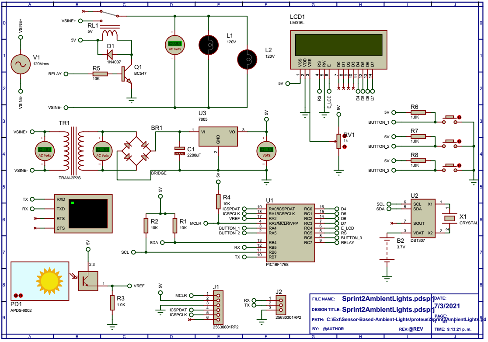

# Sensor-Based Ambient Lights &mdash; "HELA Module"

*PG‑7232 Embedded Systems &mdash; Project Sprint 2 &mdash; Universidad Simón Bolívar (2021)*

<p align="center">
  
</p>

A prototype of a **modular ambient‑light controller**: one piece of hardware that can
switch an ordinary mains **110&nbsp;V / 220&nbsp;V AC LED strip** on and off
**manually**, on a **schedule**, or **automatically from the ambient light level**.
The repository contains the microcontroller firmware ([`Hela.X`](Hela.X), an MPLAB&nbsp;X
project) and a [Proteus](https://www.labcenter.com/simulation/) project
([`proteus/`](proteus)) used to simulate and validate the electronic design.

## Table of Contents

1. [Requirements](#requirements)
2. [Hardware](#hardware)
3. [Operation Modes](#operation-modes)
4. [Firmware](#firmware)
5. [Pin Map](#pin-map)
6. [Getting Started](#getting-started)
7. [Cost](#cost)
8. [Repository Layout](#repository-layout)
9. [Further Reading](#further-reading)
10. [Authors](#authors)

## Requirements

The module was specified as a product exercise, so the design is driven by a target
cost and a fixed feature set:

* Producible in 4 weeks, from parts that are cheap and readily stocked.
* Runs directly from **110&nbsp;VAC 60&nbsp;Hz**; electronics BOM under **US$7**
  (excluding the light source and its supply).
* An **8‑bit PIC**.
* Operation modes: on/off by **light sensor**, on by **schedule (alarm)**, off by
  **timer** (15/30/45/60&nbsp;min).
* A user interface, and it must **keep its operating mode across a power failure**.
* Factory test / programming hooks.
* Target retail price US$70, with total production cost ≈ 50% of that.

## Hardware

<p align="center">
  
  <em>Full schematic: <a href="Schematic.pdf">Schematic.pdf</a></em>
</p>

| Block | Part | Notes |
| ----- | ---- | ----- |
| MCU | **PIC16F1768** (20‑pin, 8‑bit) | ~17 I/O needed; has I²C, 2× 10‑bit ADC, and Flash for persistent state |
| Power | **HLK‑10M05** AC/DC module | Non‑isolated, 5&nbsp;VDC @ 700&nbsp;mA, 3&times;2&nbsp;cm &mdash; only powers the logic, so it can stay small and cheap |
| Light sensor | **APDS‑9002** ambient light photosensor | Current output (~µA) across a load resistor, read by the ADC |
| Real‑time clock | **DS1307** module with battery backup | Keeps time through a mains outage (see firmware note below) |
| Relay | **HF46F‑5‑HS1** (5&nbsp;VDC coil, 5&nbsp;A, 110&ndash;220&nbsp;VAC) | Driven by a **BC547** + base resistor; **1N4007** flyback diode across the coil |
| Display | **LM016L** 16&times;2 character LCD | 4‑bit interface |
| Buttons | 3&times; momentary, pull‑up | *Select / mode*, *Accept / enter*, *Cancel* |
| Light source | 110&nbsp;VAC LED strip, ~7&nbsp;W/m, cut every 1&nbsp;m | Not in the electronics BOM &mdash; length is up to the customer |

## Operation Modes

The LCD shows the current screen; the three buttons walk a small menu:

| # | Mode | What it does |
| - | ---- | ------------ |
| 0 | **Home** | Shows the time and whether the light is forced ON. *Accept* toggles a manual ON/OFF override. *Select* cycles to the other menu items. |
| 1 | **Configure time** | Set the clock hours / minutes / seconds with *Accept*, confirm with *Select*. |
| 2 | **Auto ON/OFF (schedule)** | Enter a start and end time; the light is ON while the clock is inside that window. |
| 3 | **Night light (sensor)** | Toggle "use the light sensor" with *Accept*; the screen shows the live sensor reading as a percentage. Pressing *Select* here **captures the current reading as the darkness threshold** &mdash; below it, the light turns on. |

The relay logic (`verifyLights()`) is a simple priority chain: manual override →
inside the scheduled window → ambient light below the captured threshold → otherwise
off.

## Firmware

`Hela.X/main.c` is a single cooperative loop:

```
read the light sensor (ADC AN2)
read the three buttons (edge-detected)
render the current menu screen on the LCD
decide whether the relay should be on
print time + sensor value on the debug UART (9600 baud)
```

Supporting code: `LCD_Lib.c/.h` (4‑bit HD44780 driver) and the MPLAB Code Configurator
output in `Hela.X/mcc_generated_files/` (device config, ADC, EUSART, pin manager). The
device runs from the **8&nbsp;MHz** internal oscillator.

**Scope of this version.** The committed firmware implements the menu, the light
sensor, the schedule comparison and the relay control. The DS1307 is present in the
hardware design and the schematic, but this build does **not** yet read it over I²C
(no MSSP/I²C module is generated by MCC and there is no timekeeping interrupt) &mdash;
the clock is set and held through the "Configure time" screen. Wiring the RTC and
persisting the selected mode to Flash are the natural next steps.

## Pin Map

| PIC pin | Signal |
| ------- | ------ |
| RA4 | Button &mdash; Select / mode |
| RA5 | Button &mdash; Accept / enter |
| RC6 | Button &mdash; Cancel |
| RA2 | Light sensor (ADC AN2) |
| RC0&ndash;RC3 | LCD data D4&ndash;D7 |
| RC4 / RC5 | LCD RS / E |
| RC7 | Relay drive |
| RB5 / RB7 | Debug UART RX / TX (9600 baud) |
| RA0 / RA1 | ICSP data / clock |

## Getting Started

### Dependencies

* [MPLAB X](https://www.microchip.com/en-us/development-tools-tools-and-software/mplab-x-ide)
  with the XC8 compiler.
* [Proteus](https://www.labcenter.com/simulation/) &mdash; the project uses only stock
  library parts.

### Build & simulate

```
git clone https://github.com/leonardoward/Sensor-Based-Ambient-Lights.git
```

1. Open `Hela.X` in MPLAB X and build it to produce `Hela.X.production.hex`
   (a pre‑built copy is included at the repo root and in `proteus/`).
2. Open `proteus/Sprint2AmbientLights.pdsprj`, point the PIC model at the `.hex`, and
   run. The Proteus virtual terminal shows the debug output.

## Cost

From the report's BOM analysis:

| | 1 unit | 100 units | 1000 units |
| - | ------ | --------- | ---------- |
| Electronics only | $7.17 | $6.83 | $6.70 |
| Electronics + 2&nbsp;m LED strip | $10.65 | $10.31 | $10.18 |
| Full production cost (incl. assembly + lamp materials) | $31.65 | $31.31 | $31.18 |

At ≈ $31 against a $70 retail price the module lands inside the 50% target.

## Repository Layout

```
Hela.X/                      MPLAB X project
  main.c                     application loop + menu state machine
  LCD_Lib.c / .h             4-bit HD44780 LCD driver
  mcc_generated_files/       MPLAB Code Configurator output
Hela.X.production.hex        pre-built firmware
proteus/                     Proteus project + a copy of the .hex
Documents/                   design report (PDF) and BOM (PDF)
Schematic.pdf                exported schematic
images/                      schematic + demo thumbnails
```

## Further Reading

The [`Documents/`](Documents) folder has the full design report
(`PG7232_Sistemas_Embebidos_Grupo_1_Proyecto_2.pdf`) and the bill of materials.
A [demo video](https://youtu.be/3KqcJgEQBLA) shows the last firmware version running in
simulation.

## Authors

* **[Carlos Sanoja](https://github.com/CarSanoja)**
* **[Jesús Guillen](https://github.com/JG-Guillen)**
* **[Leonardo Ward](https://github.com/leonardoward)**
* **[Mauricio Marcano](https://github.com/rinripper)**
* **[Oscar Moreno](https://github.com/OscarEMoreno)**
* **[Vincenzo D'Argento](https://github.com/vincdargento)**
